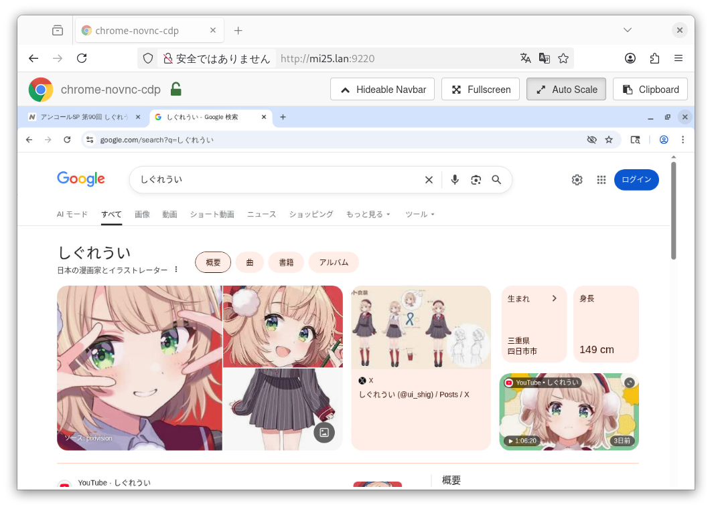

# Chromium with NoVNC

|English|[日本語](README.ja.md)|



- Run Chromium browser inside a Docker container and remotely access the containerized Chromium browser from your browser using noVNC
- Useful for running browsers on servers for web scraping and automation tasks using LLMs


## How to Run
```
docker compose up
```

Access http://localhost:9220


## Usage Example: Using with browser-use
```python
browser_session = BrowserSession(
    headless=False,
    window_size={"width": 1280, "height": 1024},
    viewport={"width": 1248, "height": 895},
    cdp_url="http://localhost:9222",
    keep_alive=True
)
```
